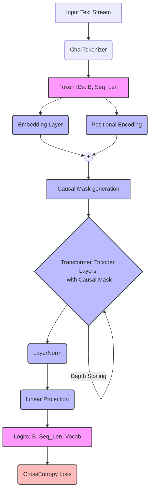

# 🔬 Research-Grade Causal Transformer Framework

A high-performance, memory-optimized character-level Transformer framework built for rigorous hyperparameter grid searching and causal language modeling. Designed specifically for Kaggle environments, it features deterministic reproducibility, aggressive logging, and efficient dataset slicing.

---

## 🚀 Key Features

* **Causal Masking:** Autoregressive objective using `torch.triu` masks for next-token prediction.
* **Deterministic Execution:** Strict seed-setting across NumPy, PyTorch, and CUDA for 100% reproducible research.
* **Aggressive Grid Search:** Automated `itertools.product` exploration across network depth, width, attention heads, and activation functions.
* **Deep Logging:** Granular batch-level and epoch-level tracking (Loss, Perplexity, LR, Time) exported directly to a tidy CSV format.
* **Memory Optimized:** `CharTokenizer` and `TextDataset` rely on efficient tensor slicing rather than heavy pre-allocation.

---

## 🧠 Architecture Overview

The model employs a standard Decoder-only Transformer architecture, adapted for character-level generation. Below is the interactive data-flow diagram (rendered automatically in Markdown via Mermaid.js).

